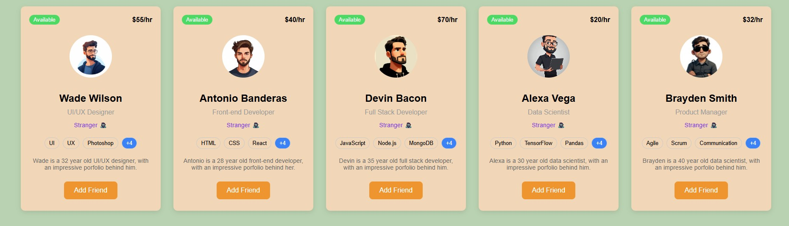

# UI-Cards-Functionality

A simple, responsive UI profile cards application built with HTML, CSS, and JavaScript.

## Features

- **Dynamic Profile Cards:** Displays a list of user profile cards with image, name, designation, status, skills, and about section.
- **Friend Request Simulation:** Each card has a button to "Add Friend", which changes status to "Waiting for response..." and then to "Friends" after 5 seconds. You can also remove a friend.
- **Responsive Design:** The layout adapts to different screen sizes for optimal viewing on desktop and mobile devices.
- **Skill Badges:** Shows user skills as badges on each card.

## Files

- [`index.html`](index.html): Main HTML file that loads the app.
- [`style.css`](style.css): Styles for layout, cards, and responsiveness.
- [`script.js`](script.js): Handles dynamic rendering and interactivity of the cards.

## How It Works

1. **Data Source:** User data is stored in an array in [`script.js`](script.js).
2. **Rendering:** The `hero()` function dynamically generates the HTML for each card and injects it into the `<main>` element.
3. **Interactivity:** Clicking the button on a card updates the user's friend status and re-renders the cards to reflect changes.

## Usage

1. Clone or download this repository.
2. Open [`index.html`](index.html) in your browser.
3. Interact with the profile cards by clicking the "Add Friend" or "Remove Friend" buttons.

## Screenshots

## Customization

- To add or modify users, edit the `arr` array in [`script.js`](script.js).
- To change styles, edit [`style.css`](style.css).

## License

This project is for educational/demo purposes.